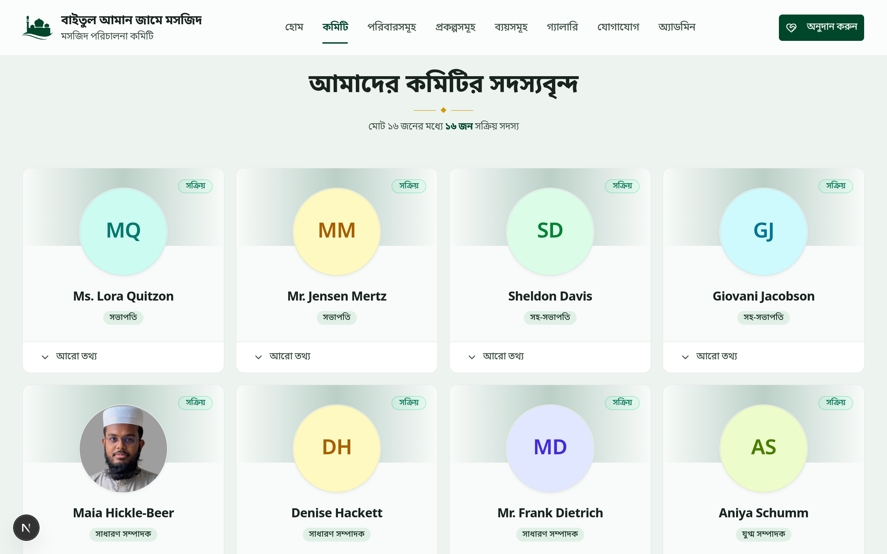
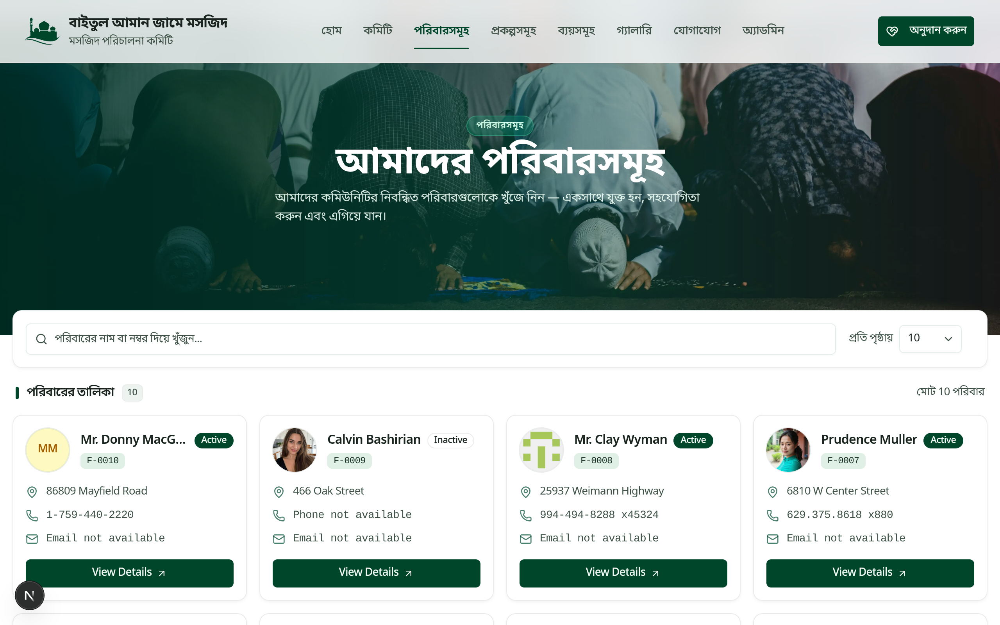
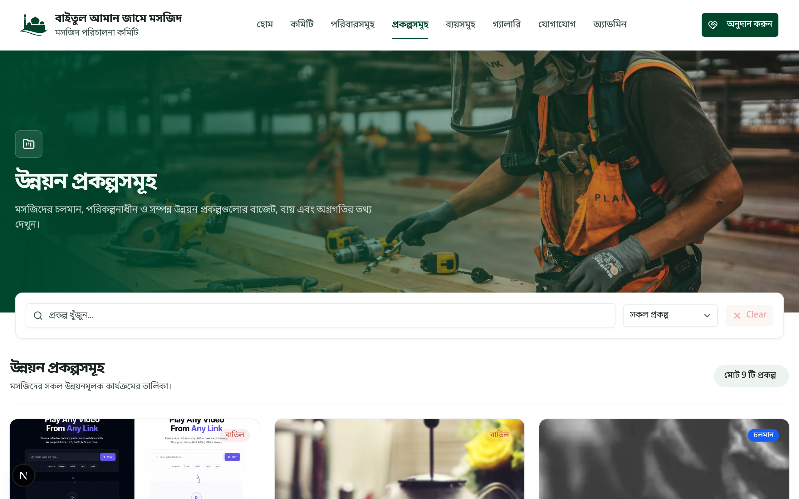
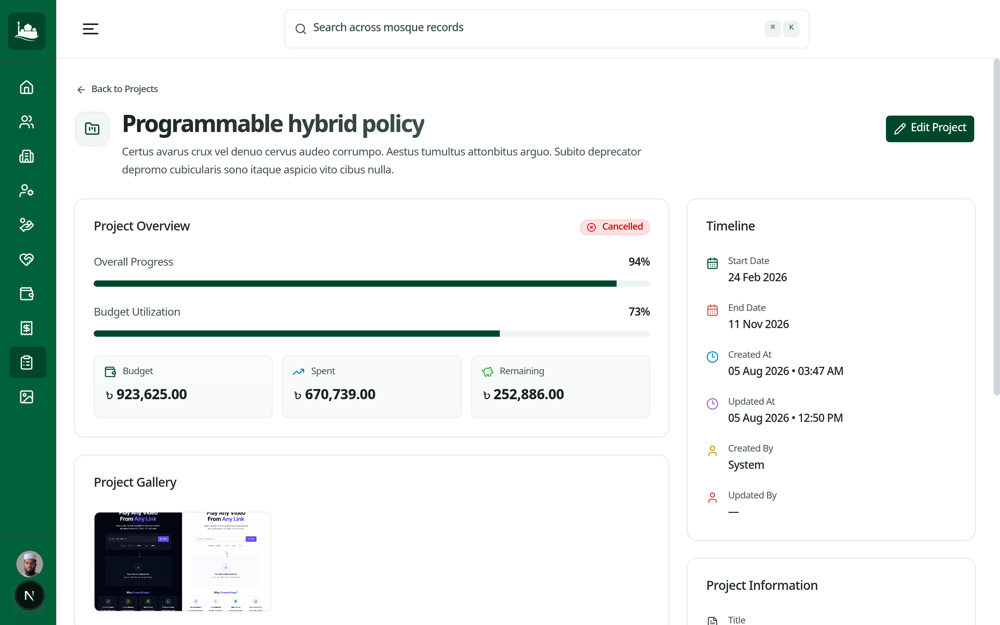
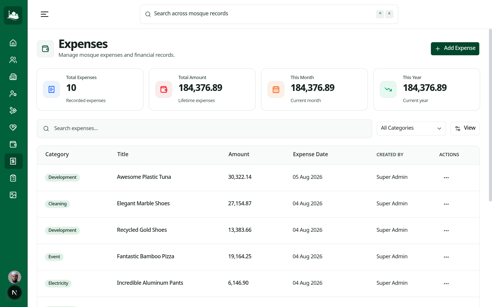
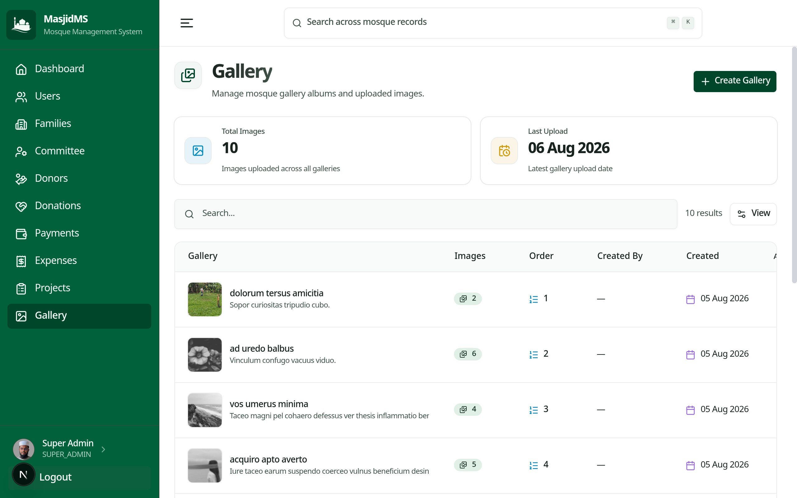
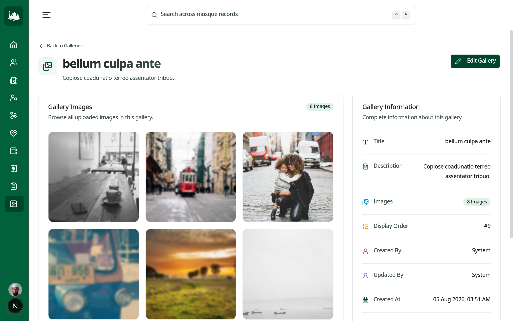

# Mosque Management System — Frontend

[](https://nextjs.org/) [](https://react.dev/) [](https://www.typescriptlang.org/) [](https://redux-toolkit.js.org/)

A responsive public website and administration console for a mosque. It publishes mosque information, families, projects, galleries, expenses, and contact details, while authenticated users manage records, finances, media, and daily prayer times.

> **Note:** This is the Next.js client for the companion [NestJS API](../Backend/README.md). A Next.js rewrite keeps browser API calls same-origin so the API's HTTP-only authentication cookie works correctly.

## Features

### Public site

- Home page with mosque statistics, financial summary, prayer times/clock, committee, projects, gallery, activities, hadith, and contact/donation calls to action.
- Committee directory, family directory and individual family pages with payment summary and filtered ledger.
- Transparent expense listing with filtering UI.
- Project list/details with status, progress, timeline, and image gallery.
- Gallery list/details with image viewing; contact page with departments, office hours, FAQ, emergency contact, map, social links, and contact-form UI.
- Privacy-policy and terms pages, responsive navigation/footer, and scroll-to-top behavior.

### Administration

- Cookie-protected dashboard with summary cards, charts, recent donations, and recent expenses.
- Search dialog with shortcut, debounced grouped results, result highlighting, and recent searches.
- Resource workflows for committee, donors, donations, expenses, families, galleries, payments, projects, and users: list, details, create, edit, and deletion/actions where supported by the API.
- Family-fee history/current-fee dialogs, monthly-charge API support, receipt actions, and prayer-time editing.
- Server-backed tables with pagination, filters, sorting, column visibility, skeletons, empty/error states, dialogs, and unsaved-change feedback.
- Zod + React Hook Form validation, Sonner notifications, avatar cropping, drag/drop uploads, and signed direct browser-to-Cloudinary image uploads.

## Tech stack

| Area | Technology |
| --- | --- |
| Language/framework | TypeScript, Next.js 16 App Router, React 19 |
| UI | Tailwind CSS 4, shadcn/ui, Radix UI, CVA, `tailwind-merge` |
| State/API | Redux Toolkit, RTK Query, React Redux; Axios helper |
| Forms | React Hook Form, Zod, `@hookform/resolvers` |
| Data display | TanStack React Table, Recharts, date-fns |
| Motion/media | Framer Motion, React Dropzone, React Easy Crop, Yet Another React Lightbox |
| Utilities | Lucide React, Sonner, clsx |

The image configuration permits Cloudinary and Picsum remote images. No frontend database is used.

## Installation

```bash
git clone <repository-url>
cd mosque-management/Frontend
npm install
npm run dev
```

Open [http://localhost:3000](http://localhost:3000). Start the backend too and configure its origin below.

> **Tip:** A `pnpm-lock.yaml` is included, but the documented scripts work with `npm`. Use one package manager consistently in a checkout.

## Environment variables

Create `.env.local` (or update `.env`):

```env
NEXT_PUBLIC_API_URL=http://localhost:3000
```

This required value is the backend origin without `/api/v1`. `next.config.ts` rewrites `/api/v1/:path*` to that backend, and the Axios helper also uses it. RTK Query requests `/api/v1` from the frontend origin with credentials included.

## Scripts

| Command | Description |
| --- | --- |
| `npm run dev` | Start the development server. |
| `npm run build` | Create an optimized production build. |
| `npm run start` | Serve a production build. |
| `npm run lint` | Run ESLint. |
| `npm run typecheck` | Type-check without emitting files. |
| `npm run format` | Format TypeScript/TSX with Prettier. |

## Folder structure

```text
src/
├── app/
│   ├── (public)/                 # Public routes and layout
│   ├── (auth)/                   # Login and password-recovery routes
│   ├── (admin)/admin/            # Dashboard and management routes
│   ├── provider.tsx              # Redux, tooltip, dialog, toast providers
│   └── proxy.ts                  # Cookie-based route redirects
├── components/
│   ├── common/                   # Tables, uploaders, pickers, shared states
│   ├── layouts/                  # Admin shell, public navbar/footer
│   ├── icons/                    # Project icons
│   └── ui/                       # shadcn/Radix primitives
├── config/ constants/            # Routing, permissions, metadata, domain constants
├── features/
│   ├── admin/                    # Dashboard and management feature slices
│   ├── auth/                     # Authentication UI
│   └── public/                   # Public page feature slices
├── hooks/ lib/                   # Upload/mobile hooks, Axios and Cloudinary helpers
├── schemas/                      # Zod schemas
├── services/api/                 # Imperative API services
├── store/                        # RTK Query endpoints and UI state
├── types/                        # Domain/API types
└── utils/                        # Formatting, status, image, and form helpers
```

## Architecture

Route files are thin App Router entry points that mount components from `features/`. Features group their list, details, create/edit, shared forms, hooks, and local components by domain. Broadly reusable pieces live in `components/common` and `components/ui`; schemas, types, constants, and utilities are centralized.

RTK Query is the primary server-state layer. `base.api.ts` provides a credentialed `/api/v1` base query and tags for auth, dashboard, families/fees/charges/payments, donors/donations, expenses, committee, projects, galleries, users, prayer times, uploads, and search. A separate `ui` slice manages UI state. `proxy.ts` redirects unauthenticated `/admin` requests to login and redirects signed-in users away from auth routes based on the `access_token` cookie.

The upload hook requests a signed Cloudinary payload from the API, uploads the browser file directly to Cloudinary with progress callbacks, then creates the database `File` record through the API.

## Pages

| Area | Routes |
| --- | --- |
| Public | `/`, `/committee`, `/families`, `/families/[familyId]`, `/expenses`, `/projects`, `/projects/[projectId]`, `/galleries`, `/galleries/[galleryId]`, `/contact`, `/privacy-policy`, `/terms` |
| Authentication | `/login`, `/forgot-password`, `/reset-password` |
| Dashboard | `/admin/dashboard` |
| Management | `/admin/{committee,donations,donors,expenses,families,gallery,payments,projects,users}` plus each resource's `create`, `[id]`, and `[id]/edit` pages |
| Other admin | `/admin/settings` |

The public home contains prayer times. While prayer-time components/admin editing exist, no standalone public `/prayer-times` page route currently exists.

## Components, responsiveness, and performance

The reusable layer includes public navigation/footer, admin sidebar/navbar, data tables, entity pickers, pagination, page headers/loaders, stats cards, upload controls, and error/empty/not-found states. Navigation switches to a mobile sidebar and the `use-mobile` hook supports viewport-aware components. Tailwind styling, Next remote image handling, API rewriting, loading skeletons, and deferred query states are the current optimization approach.

## Screenshots

### Home


---

### Committee



---

### Families



---

### Projects




---

### Project Details


---

### Expenses



---

### Gallery



---

### Gallery Details



---

### Contact


## Future improvements

- Add a standalone public prayer-times page if needed.
- Add component, integration, and end-to-end test coverage.
- Complete the planned RTK Query 401/refresh handling.
- Expand accessible media metadata and upload test coverage.
